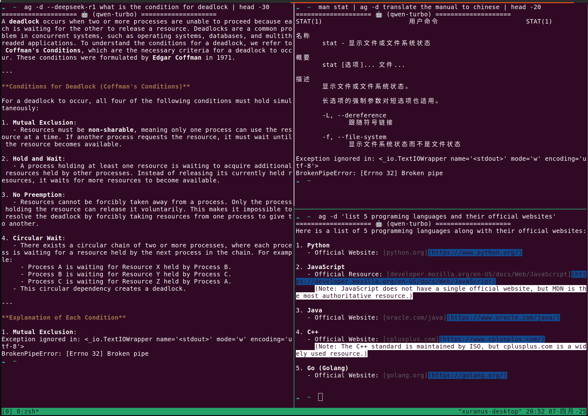

# AI Agent





```
AG - AI Command Line Assistant powered by OpenAI SDK
Usage:
  [command] | ag -d [prompt]
  ag [options]

Options:
  -m, --model MODEL   Specify LLM model (default: deepseek-r1)
  -d, --prompt PROMPT Task description/prompt (required)
  --plain             Plain text output
  --clean             Clear session history
  -h, --help          Show this help message

Examples:
  man read | ag -d "Translate to Chinese"
  ag --model gpt-o1 -d "Explain quantum computing"

Available Models:
  deepseek-r1 (default)
  qwen-long
  qwen-turbo
  qwen-max
  qwen-max-longcontext
  qwen-plus
```


### install
```bash
sudo pip install openai python-dotenv -i https://pypi.tuna.tsinghua.edu.cn/simple
```

```bash
# ~/zsh.rc
export AG_DASHSCOPE_API_KEY="sk-1234567890987654321" # Aliyun key
export AG_MODEL_DEFAULT="deepseek-r1"
alias ag='python3 $HOME/scripts/ag/ag.py'
```
